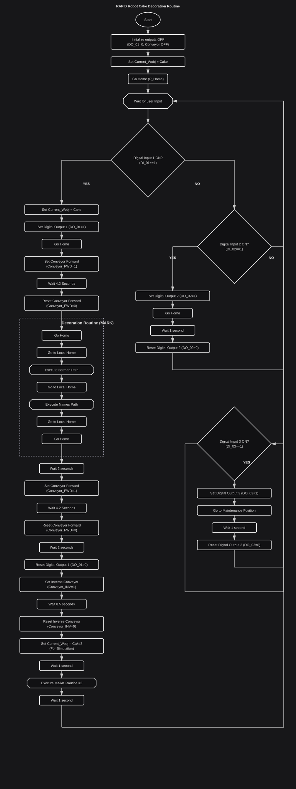
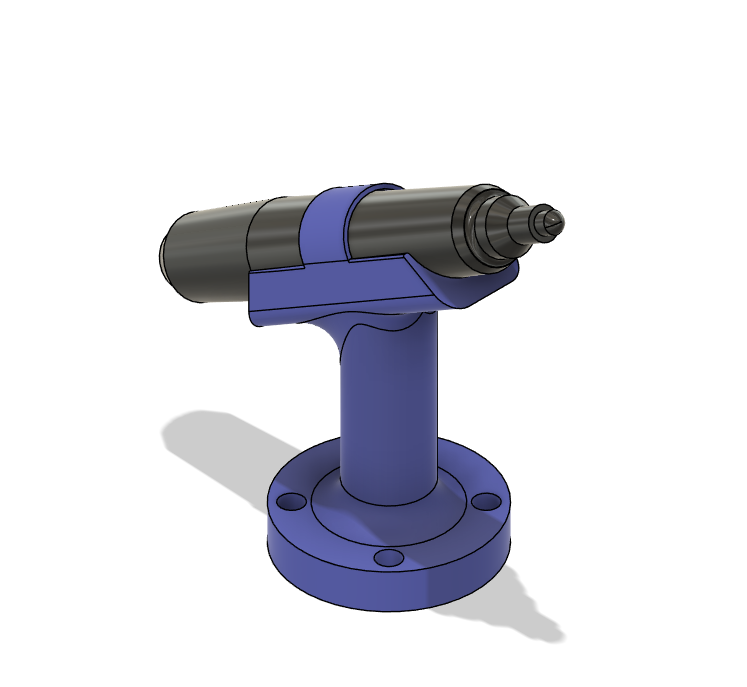
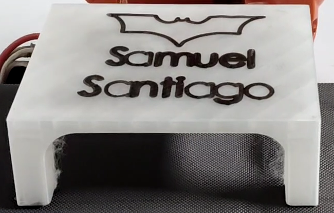

<div align="center">
  
</div>

---

# 🤖 robotic-ABB — RobotStudio · ABB IRB140

> **Resumen:** Práctica de laboratorio del curso *Robótica Industrial* que integra diseño CAD, simulación en RobotStudio y ejecución real con **ABB IRB140**. El sistema automatiza el trazo de dibujos sobre piezas transportadas por un conveyor usando una herramienta *Marker* diseñada e impresa para la tarea.

---

## 📌 Contenido del repositorio

- `ABB-Calibration/` — Archivos y módulos de calibración usados en RobotStudio.  
- `Design/` — Modelos CAD (Fusion360), SAT/ACIS, planos PDF y archivos de impresión 3D.  
- `Diagrams/` — Diagramas de flujo (Mermaid `.mmd`), `.svg` y planos de planta en `.pdf`.  
- `RS/robotic-ABB-Cake/` — Proyecto RobotStudio y configuración (Tool / Wobj) usada en simulación.  
- `Sources/` — Imágenes y GIFs de simulación y pruebas (`Simulation.gif`, `Real.gif`, `Results.png`).  
- `Zips/` — Paquetes RobotStudio exportados (.rspag / .zip).  
- `Laboratorio_No_1.pdf` — Documento del laboratorio y requerimientos (incluye la sección 4.6).  
- `README.md`, `LICENSE`, `.gitattributes`, etc.

---

## 🗂 Estructura (vista rápida)

```
robotic-ABB/
├─ ABB-Calibration/
├─ Design/
│ ├─ Marker_Base_Plane.pdf
│ ├─ Assembly Plane.pdf
│ └─ ...
├─ Diagrams/
│ ├─ Flowchart_lab1_eng.svg
│ └─ Plant_Plan.pdf
├─ RS/
│ └─ robotic-ABB-Cake/
├─ Sources/
│ ├─ Simulation.gif
│ ├─ Real.gif
│ └─ Results.png
├─ Zips/
├─ Laboratorio_No_1.pdf
└─ README.md
```


---

## 📘 Descripción detallada de la solución planteada

El objetivo es **automatizar el trazado de dibujos sobre piezas** transportadas por una banda (conveyor), simulando procesos industriales de decoración/marking (p. ej. decorado de tortas). El ABB IRB140 detecta la llegada y posición de la pieza mediante sensores digitales, sincroniza el conveyor y ejecuta rutinas de trazado de alta precisión con la herramienta *Marker*.

**Componentes principales**
- **Robot:** ABB IRB140 — movimientos articulares, lineales y circulares para posicionamiento y trazado.  
- **Conveyor:** controlado por salidas digitales; modelo tomado de GrabCAD.  
- **Herramienta (Marker):** diseño 3D impreso y calibrado en RobotStudio.  
- **WorkObject (Cake):** sistema de coordenadas para las trayectorias.

**Referencia del conveyor:**  
> *Modular Belt Conveyor 1.2m* — https://grabcad.com/library/modular-belt-conveyor-1-2m-1

---

## 🔁 Diagrama de flujo y plano de planta

- **Diagrama de flujo:** `Diagrams/Flowchart_lab1_eng.svg`  
- **Plano de planta:** `Diagrams/Plant_Plan.pdf`



---

## ⚙️ Descripción de las funciones utilizadas y cómo se aplican

> La siguiente sección explica las primitivas, señales y procedimientos empleados en la práctica, orientada a su **aplicación práctica en el banco** (sin exponer código).

### Primitivas de movimiento y su aplicación
- **MoveJ (movimiento articular)**  
  - *Qué hace:* mueve el robot actuando sobre sus ejes (espacio articular).  
  - *Cómo se aplica:* transiciones rápidas a posiciones seguras o de reposo (p. ej. `Home`, `Maintenance`) y desplazamientos fuera de la zona de trazado.

- **MoveL (movimiento lineal)**  
  - *Qué hace:* traslada la herramienta en línea recta manteniendo orientación.  
  - *Cómo se aplica:* trazado de líneas rectas y posicionamientos precisos relativos al `WorkObject` (letras, segmentos rectos).

- **MoveC (movimiento circular)**  
  - *Qué hace:* genera trayectorias en arco entre puntos definidos.  
  - *Cómo se aplica:* ejecución de curvas suaves en el ícono (p. ej. contornos del logo), manteniendo continuidad de trayectoria.

### Control de E/S y sincronización
- **SetDO (salidas digitales)**  
  - *Qué hace:* activa/desactiva salidas físicas (relés, motores, LEDs).  
  - *Cómo se aplica:* controla el conveyor (`Conveyor_FWD`, `Conveyor_INV`) y enciende indicadores físicos (`DO_01`, `DO_02`, `DO_03`) que informan al operador el estado del proceso (ejecución, aviso, mantenimiento).

- **WaitTime (esperas temporales)**  
  - *Qué hace:* pausa la ejecución por un intervalo.  
  - *Cómo se aplica:* sincronizar arranque/parada del conveyor con la posición de la pieza y permitir asentamiento mecánico antes de trazar.

### Procedimientos / bloques funcionales (roles prácticos)
- **main() — Supervisión y coordinación**  
  - *Rol:* máquina de estado de alto nivel. Lee sensores (entradas digitales), dispara rutinas de conveyor y trazado, y controla indicadores.  
  - *Aplicación práctica:* al detectar pieza inicia secuencia completa (avance, marcado, retorno); otras entradas disparan pruebas o mantenimiento.

- **MARK() — Orquestador del trazado**  
  - *Rol:* encapsula la secuencia completa de marcado (preparación, trazado principal, detalles, retorno).  
  - *Aplicación práctica:* permite ejecutar el marcado como una unidad reutilizable.

- **P_Home() / P_Local_Home() — Referencias**  
  - *Rol:* posiciones global y local para inicio/retorno.  
  - *Aplicación práctica:* reducen acumulación de error y facilitan reentrada tras interrupciones.

- **P_Bat() / P_Names() — Rutinas de trazo**  
  - *Rol:* agrupación de trayectorias del ícono y del texto.  
  - *Aplicación práctica:* modulares y editables para cambiar figura o texto sin tocar la lógica de control.

- **P_Maintenance() — Posición de intervención**  
  - *Rol:* dejar el robot en zona accesible para el operador.  
  - *Aplicación práctica:* facilitar ajustes, recarga del marcador o inspección en seguridad.

### Parámetros de trabajo
- **Velocidad (`vXXX`) y zona (`zX`)**: seleccionar según operación — velocidades bajas y `z1` para trazos precisos; velocidades mayores para transiciones seguras.  
- **Referencias (`Marker\WObj := Current_Wobj`)**: todas las trayectorias de marcado se referencian al `WorkObject` activo para permitir recalibraciones sin reprogramar.

---

## 🛠️ Diseño detallado de la herramienta — *Marker*



**Descripción general:**  
El *Marker* es un portamarcador desarrollado para ser robusto, recargable y de fácil mantenimiento. Se eligió un **marcador recargable** con cartucho reemplazable para **evitar mecanismos con resortes**, reduciendo puntos de fallo y simplificando el mantenimiento.

**Funcionamiento de la punta:**  
La punta opera por **presión directa**: al posicionar la herramienta sobre la pieza la punta se **sumerge ligeramente** en su alojamiento, garantizando el flujo de tinta y el contacto con la superficie. Este método evita resortes y actuadores adicionales, ofreciendo una solución simple y fiable. El encaje está diseñado con la **tolerancia apropiada** para asegurar buen contacto sin dificultar la extracción/recarga manual.

**Fabricación e impresión 3D:**  
- **Base impresa:** se imprimió con **25% de infill** (relleno) para un buen compromiso entre rigidez y consumo de material, evitando deformaciones durante uso repetido.  
- **Ajustes recomendados:**  
  - Material: **PLA** (prototipo) — **PETG/ABS** si se necesita mayor resistencia térmica/mecánica.  
  - Infill: **25%** (grid o gyroid).  
  - Perímetros: **2–3 walls**.  
  - Altura de capa: **0.15–0.25 mm**.  
- **Montaje por presión (press-fit):** la mayor parte del ensamblaje es por encaje a presión con geometrías estilizadas para un acabado estético y desmontaje fácil.

**Tolerancias y ajuste:**  
- Holgura recomendada para press-fit: **≈ 0.1–0.3 mm** según precisión de la impresora y material.  
- Para variaciones en diámetros de marcador, emplear pestañas flexibles o ranuras elásticas que absorban tolerancias.

**Estética y ergonomía:**  
El diseño prioriza líneas suaves, transiciones redondeadas y un acabado profesional, manteniendo accesibilidad para recarga y mantenimiento.

**Mantenimiento:**  
- Recarga manual del cartucho; sin resortes ni partes móviles complejas.  
- Componentes impresos fácilmente reemplazables.

📂 **Archivos disponibles en [`Design/`](./Design/):**  
Incluye planos en **PDF**, modelos en **Fusion 360 (`.f3d / .f3z`)**, exportaciones **SAT/STL**, y ensambles completos listos para impresión o modificación.

---


## ✏️ Diseño de trayectorias


Las trayectorias se diseñaron en **Fusion 360** combinando texto y geometrías vectorizadas.  
- **Texto:** generado con la herramienta de *Sketch Text* y adaptado para extrusión.  
- **Ícono Batman:** obtenido mediante **vectorización de una imagen en 2D** y posterior extrusión.  
- Exportados a RobotStudio para convertirlos en trayectorias del ABB IRB140.

---

## 🎥 Vídeo de simulación e implementación

<div align="center">

[](https://youtu.be/sByrkLONEk4 "RobotStudio - robotic-ABB Cake")

</div>

> 🔗 Si el embed no se muestra correctamente en GitHub, haz clic en la miniatura para abrir el vídeo en YouTube.  

---


## 🖼 Previews (simulación / ejecución real / resultados)

**Simulación (RobotStudio)**  


**Ejecución real (prueba en banco)**  


**Resultados sobre la pieza**  



---

## 🧾 Autores

- **Samuel David Sanchez Cardenas** — Desarrollo, simulación y documentación.  
  [](https://github.com/samsanchezcar)

- **Santiago Ávila** — Colaboración en diseño y pruebas.  
  [](https://github.com/search?q=Santiago+Avila)

---

## 📜 Licencia

Este proyecto está bajo la licencia indicada en `LICENSE`.

---

_Last updated: 2025-10-05_
